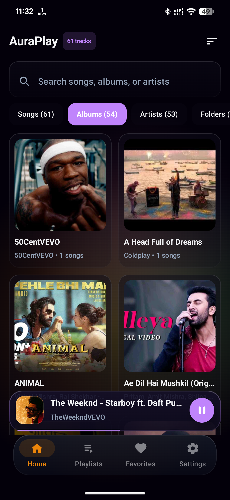
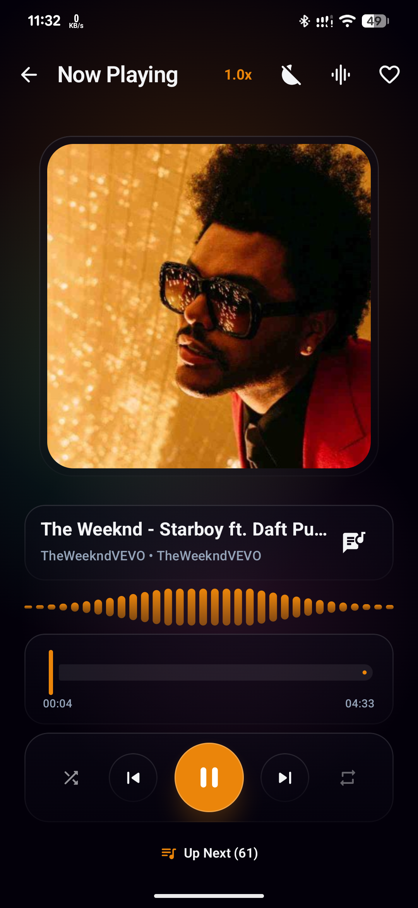
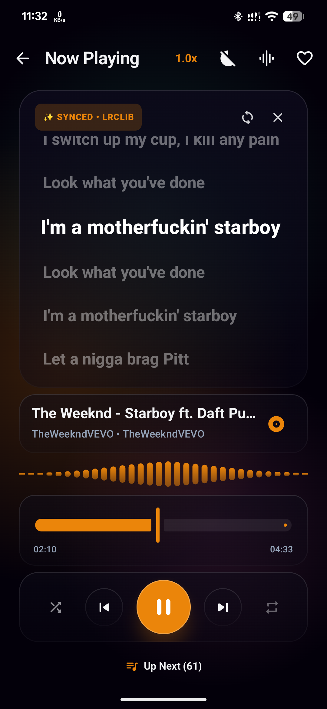

# 🎵 AuraPlay Music Player

<div align="center">


[](https://kotlinlang.org)
[](https://developer.android.com/jetpack/compose)
[](https://developer.android.com/guide/topics/media/media3)
[](https://developer.android.com/training/data-storage/room)
[](LICENSE)

<p align="center">
  <b>A modern, fluid, and aesthetic local music player for Android built entirely with Kotlin and Jetpack Compose.</b>
</p>

</div>

---

## 📱 Screenshots

<div align="center">
  <table>
    <tr>
      <td align="center" width="33%">
        <b>🏠 Home & Library</b><br/><br/>
        
      </td>
      <td align="center" width="33%">
        <b>🎧 Now Playing & Waveform</b><br/><br/>
        
      </td>
      <td align="center" width="33%">
        <b>🎤 Synced Live Lyrics</b><br/><br/>
        
      </td>
    </tr>
  </table>
</div>

---

## ✨ Features

### 🎨 Modern & Dynamic UI
* **Dynamic Aura Theme:** Real-time color extraction from album artwork using Palette API, generating vivid ambient gradients and glowing effects that adapt to each song.
* **Glassmorphism Design:** Sleek frosted-glass surfaces with customizable opacity, blur, and border highlights.
* **Pure Black (AMOLED) Mode:** Battery-saving true black background option tailored for OLED displays.
* **Custom Accent Colors:** Switch between *Dynamic Aura*, *Electric Purple*, *Cyan Blue*, *Sunset Orange*, *Emerald Green*, and *Warm Gold*.
* **120Hz Ultra-Smooth Refresh:** Smooth animations and gestures optimized for high-refresh-rate displays.

### 🎤 Synchronized Real-Time Lyrics
* **LRCLIB Integration:** Automatically fetches synchronized time-stamped lyrics online with line-by-line auto-scrolling.
* **Interactive Lyrics View:** Tap any lyric line to jump directly to that timestamp in the track.
* **Offline Caching:** Cached lyrics for quick offline viewing.

### 🎚️ Audio Enhancement & Playback
* **Built-in Multi-Band Equalizer:** Fine-tune audio frequencies with custom sliders, Bass Boost, and Virtualizer.
* **Audio Presets:** Quick presets including *Normal, Pop, Rock, Jazz, Classical, Hip Hop, Dance, Heavy Metal, Folk, and Flat*.
* **Dynamic Waveform Visualizer:** Animated interactive waveform reflecting playback progress.
* **Playback Speed:** Variable pitch-preserving speed control (0.5x to 2.0x).
* **Sleep Timer:** Set a countdown timer with smooth volume fade-out or choose **End of Track** to automatically pause when the current song completes.

### 🗂️ Smart Library & Organization
* **Categorized Navigation:** Browse by **Songs**, **Albums**, **Artists**, and device **Folders**.
* **Instant Search & Multi-Sort:** Fast search by title, artist, or album; sort by Name, Artist, Date Added, Duration, or Most Played.
* **Playlists & Favorites:** Create and manage custom playlists, reorder songs, and favorite tracks with one tap.
* **Dynamic Queue Manager:** Bottom sheet queue to view upcoming tracks, reorder items, or remove songs on the fly.

### ⚡ Background Service & Widgets
* **Media3 Foreground Service:** Seamless background playback powered by `MediaSessionService` and ExoPlayer.
* **System Media Controls:** Full support for Android 11+ notification shade and lockscreen media player with interactive seekbar and tap-to-open session activity.
* **Homescreen Widget:** Quick-access widget for playback controls, album art, and track info directly from the home screen.
* **Headphone Unplug Detection:** Automatically pauses audio when headphones are disconnected (`ACTION_AUDIO_BECOMING_NOISY`).

---

## 🛠 Tech Stack

* **Language:** 100% [Kotlin](https://kotlinlang.org/)
* **UI Framework:** [Jetpack Compose](https://developer.android.com/jetpack/compose) with Material 3
* **Audio Engine:** [AndroidX Media3 (ExoPlayer & MediaSession)](https://developer.android.com/guide/topics/media/media3)
* **Architecture:** MVVM (Model-View-ViewModel) with StateFlow
* **Database:** [Room Database](https://developer.android.com/jetpack/androidx/room) with SQLite
* **Networking:** [OkHttp 3](https://square.github.io/okhttp/) (for LRCLIB lyrics fetching)
* **Image Loading:** [Coil](https://coil-kt.github.io/coil/)
* **Color Extraction:** [AndroidX Palette](https://developer.android.com/develop/ui/views/graphics/palette-colors)
* **Preferences:** [Jetpack DataStore](https://developer.android.com/topic/libraries/datastore) (Preferences)
* **Navigation:** [Jetpack Navigation Compose](https://developer.android.com/jetpack/compose/navigation)

---

## 🚀 How to Build & Run

### Prerequisites
* **Android Studio** Hedgehog (2023.1.1) or newer
* **JDK:** 17 or higher
* **Android SDK:** Min SDK 24 (Android 7.0+), Target SDK 34 (Android 14)

### Steps
1. **Clone the repository:**
   ```bash
   git clone https://github.com/Shahriar811/AuraPlay.git
   cd AuraPlay
